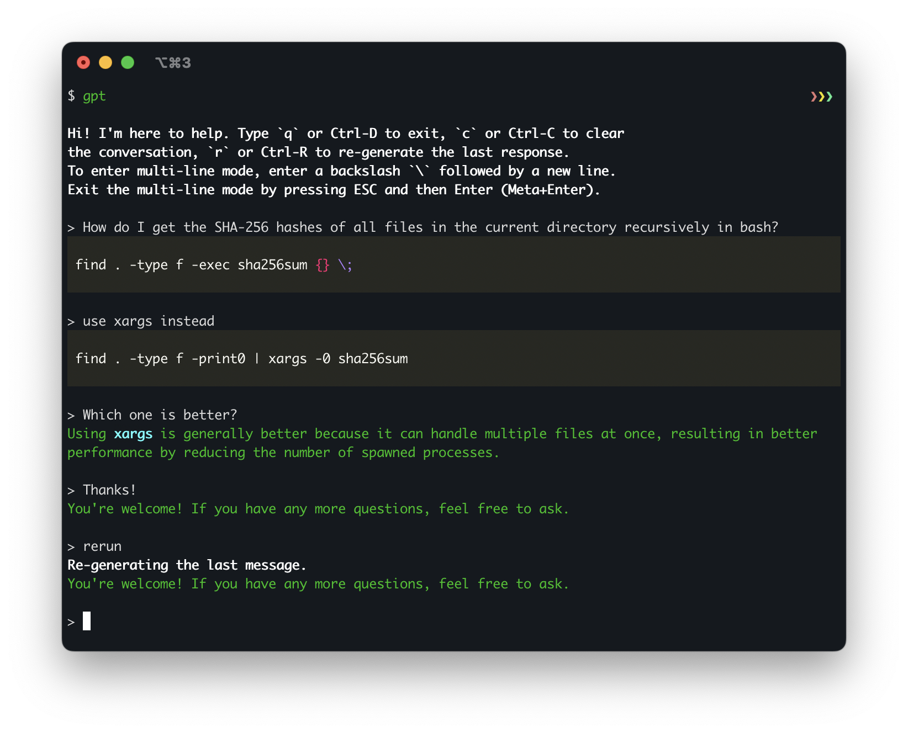

# gpt-cli

Command-line interface for ChatGPT optimized for software development.



## Usage

Make sure to set the `OPENAI_API_KEY` environment variable to your OpenAI API key (or put it in the `~/.gptrc` file as described below).

```
usage: gpt.py [-h] [--model MODEL] [--temperature TEMPERATURE] [--top_p TOP_P] [{dev,general,pirate}]

Run a chat session with ChatGPT.

positional arguments:
  {dev,general,pirate}  The name of assistant to use. `dev` (default) is a software development
                        assistant, `general` is a generally helpful assistant. You can specify your own
                        assistants in the config file ~/.gptrc. See the README for more information.

optional arguments:
  -h, --help            show this help message and exit
  --model MODEL         The model to use for the chat session. Overrides the default model defined for
                        the assistant.
  --temperature TEMPERATURE
                        The temperature to use for the chat session. Overrides the default temperature
                        defined for the assistant.
  --top_p TOP_P         The top_p to use for the chat session. Overrides the default top_p defined for
                        the assistant.
```

Type `q` or Ctrl-D to exit, `c` or Ctrl-C to clear the conversation, `r` or Ctrl-R to re-generate the last response.
To enter multi-line mode, enter a backslash `\` followed by a new line. Exit the multi-line mode by pressing ESC and then Enter.

By default, the assistant is instructed to be an expert in software development and provide short responses. You can use a more general assistant by running it with `general` argument:

```bash
$ ./gpt.py general
```

## Configuration

You can configure the assistants in the config file `~/.gptrc`. The file is a YAML file with the following structure:

```yaml
default_assistant: <assistant_name>
api_key: <openai_api_key>
assistants:
  <assistant_name>:
    model: <model_name>
    temperature: <temperature>
    top_p: <top_p>
    messages:
      - { role: <role>, content: <message> }
      - ...
  <assistant_name>:
    ...
```

You can specify the default assistant to use by setting the `default_assistant` field. If you don't specify it, the default assistant is `dev`. You can also specify the model, temperature and top_p to use for the assistant. If you don't specify them, the default values are used. These parameters can also be overridden by the command-line arguments.

Example:

```yaml
default_assistant: general
api_key: <openai_api_key>
assistants:
  pirate:
    model: gpt-4
    temperature: 1.0
    messages:
      - { role: system, content: "You are a pirate." }
```

```
$ ./gpt.py pirate

> Arrrr
Ahoy, matey! What be bringing ye to these here waters? Be it treasure or adventure ye seek, we be sailing the high seas together. Ready yer map and compass, for we have a long voyage ahead!
```
